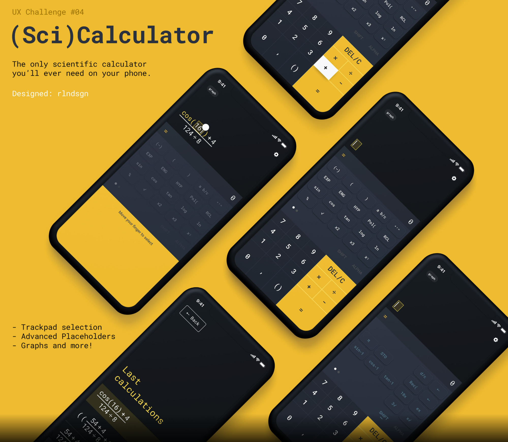
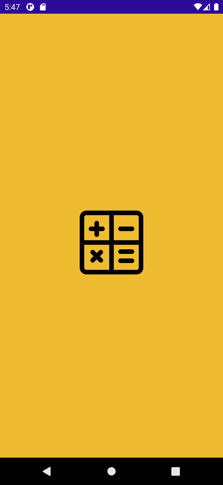

# MauiScientificCalculator (UPDATED TO MAUI GA RELEASE)
A simple scientific calculator built uisng .NET MAUI Preview 14. Based ont his [Behance Concept](https://www.behance.net/gallery/79810231/UIUX-Challenge-04-05-Calculator-App-Icon). 

## Roadmap
This is a full working app. The following enhancements are in the pipeline:
* Implement nested scientific operators (for auto bracket closing)
* Implement statistical operators (row 1 operators)
* Test on iOS

## Screen Shots
### Original Behance Design

### MAUI App - Splash Screen

## MAUI App - Calculator Screen

